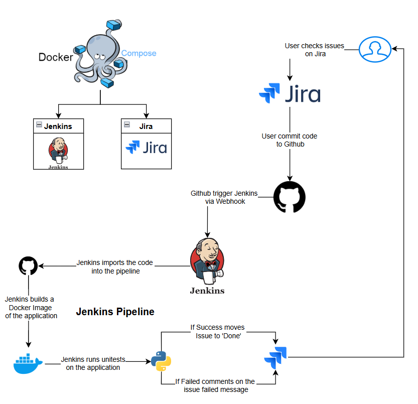

# 💸Stock Calculator Web App

This is a simple web application built with Flask that calculates stocks amount, stop loss, and deal cost for stock trading. It allows users to input the high and low values of a candle along with the desired risk amount. 

- **Stock Amount**: The number of stocks to buy based on the risk.
- **Total Deal Cost**: The total cost of the deal based on stock amount.

## Features

- User-friendly form to input candle high, low, and risk amount.
- Displays results dynamically after submitting the form:
  - Enter position At, Stop loss 
  - Stock amount to buy
  - Total deal cost $

## Technologies Used

- **Flask**: Web framework for building the application.
- **HTML**: For structuring and styling the frontend.
- **Python**: Backend logic for calculations.
- **Jenkins**: Automates the CI pipeline.  
- **Docker & Docker Compose**: Containerizes the application and manages dependencies.  
- **Ngrok**: Exposes the local Jenkins server to the internet (for Github Webhook).  
- **Jira**: Tracks issue.  


## Pipeline Steps
1. **Environment** - Set the issue key as an environment variable.  
2. **Checkout the repository** - Clones the latest code from Git.  
3. **Build the Docker image** - Creates a Docker image from the applications source code.  
4. **Run unit tests** - Executes tests within the Docker container.  
5. **Cleanup** - Removes the Docker images and cleans the environment.
6. **Results**: ✅If the pipeline succeeds, the Jira issue moves to **Done**. ❌Else, a failure comment is added to the issue.  

## Pipeline



## Required Jenkins Plugins  

Before running the pipeline, ensure you have the following Jenkins plugins installed:  
🔹 Git & GitHub Plugins, Jira Plugin, Docker Pipeline Plugin

You can install these plugins in **Jenkins > Manage Jenkins > Manage Plugins** under the **Available Plugins** tab.  


## Jenkins Pipeline: Get Jira Transitions
This pipeline retrieves the available transitions for a Jira issue using the `jiraGetIssueTransitions` step.
```groovy
pipeline {
    agent any
    stages {
        stage('Get Jira Transitions') {
            steps {
                script {
                    def transitions = jiraGetIssueTransitions(
                        idOrKey: 'YOUR-ISSUE-KEY', 
                        site: 'YOUR-SITE'
                    )
                    echo "Available transitions: ${transitions}"
                }
            }
        }
    }
}
```
