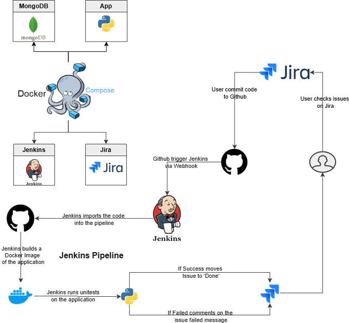

# Stock Calculator Web App

This is a simple web application built with Flask that calculates position size, stop loss, and deal cost for stock trading. It allows users to input the high and low values of a candle along with the desired risk amount. The app then calculates the following:

- **Enter Position**: The price at which the trade will be entered.
- **Stop Loss**: The price at which the trade will be stopped to limit losses.
- **Stock Amount**: The number of stocks to buy based on the risk.
- **Total Deal Cost**: The total cost of the deal based on stock amount and enter position.

## Features

- User-friendly form to input candle high, low, and risk amount.
- Displays results dynamically after submitting the form:
  - Enter position
  - Stop loss
  - Stock amount to buy
  - Total deal cost

## Technologies Used

- **Flask**: Web framework for building the application.
- **HTML/CSS**: For structuring and styling the frontend.
- **Python**: Backend logic for calculations.


## Jenkins Pipeline: Get Jira Transitions

This pipeline retrieves the available transitions for a Jira issue using the `jiraGetIssueTransitions` step.

## Pipeline Steps
1. **Set the issue key as an environment variable**  
2. **Checkout the repository** - Clones the latest code from Git  
3. **Build the Docker image** - Creates a Docker image from the applications source code  
4. **Run unit tests** - Executes tests within the Docker container  
5. **Cleanup** - Removes the Docker images and cleans the environment 


```groovy
pipeline {
    agent any
    stages {
        stage('Get Jira Transitions') {
            steps {
                script {
                    def transitions = jiraGetIssueTransitions(
                        idOrKey: 'YOUR-ISSUE-KEY', 
                        site: 'Jira-Stock'
                    )
                    echo "Available transitions: ${transitions}"
                }
            }
        }
    }
}


